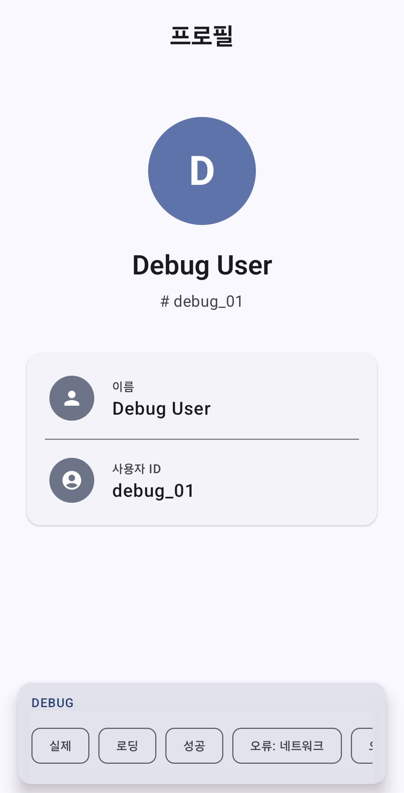
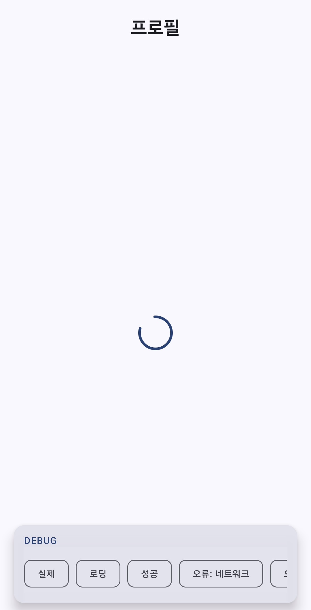
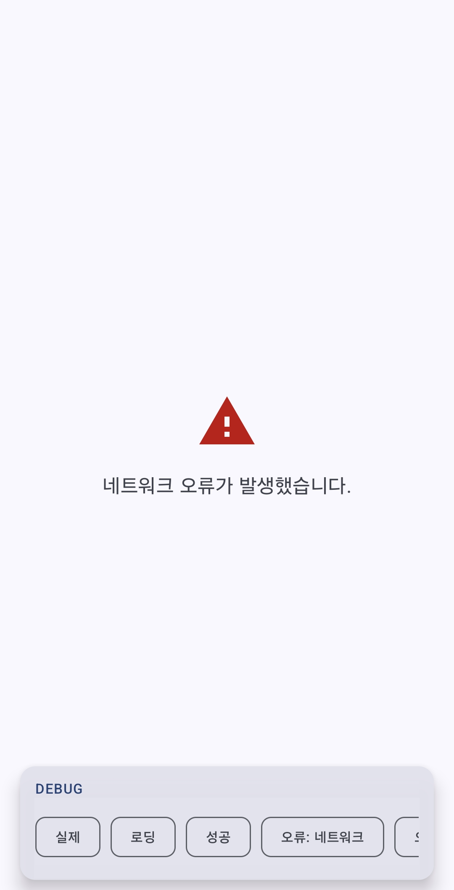
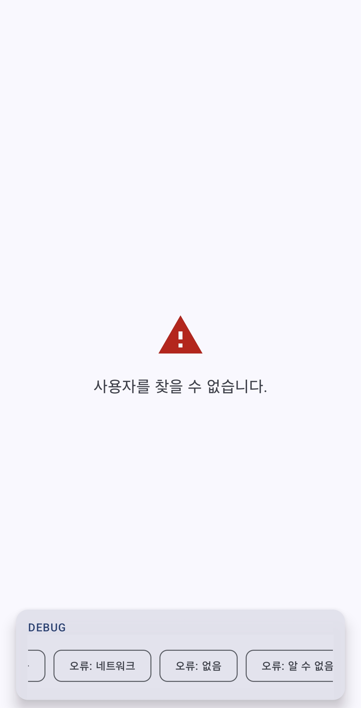
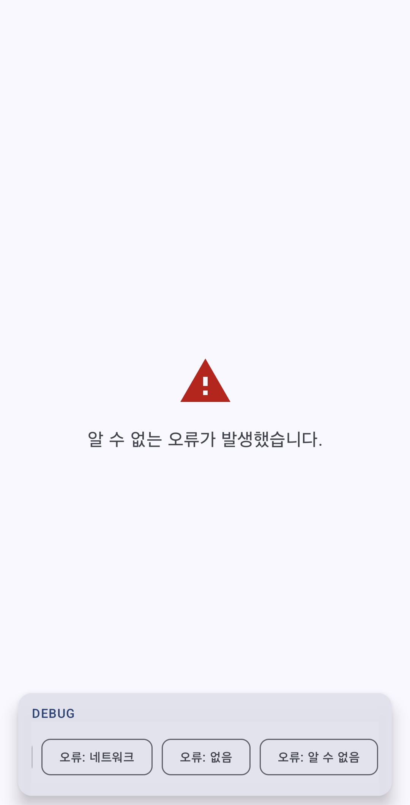

# Hilt Practice — Antigravity

Manual DI(수동 의존성 주입)로 시작해 Hilt DI 프레임워크를 적용하는 마이그레이션 과정을 단계적으로 학습한 Android 프로젝트입니다.  
단순 적용에 그치지 않고 코드 리뷰 → 13개 이슈 리팩토링 → 테스트 추가까지 실제 배포 수준의 코드 품질을 목표로 작성했습니다.

---

## 화면 미리보기

| 성공 | 로딩 | 에러: 네트워크 |
|:---:|:---:|:---:|
|  |  |  |

| 에러: 없음 | 에러: 알 수 없음 |
|:---:|:---:|
|  |  |

> 실제 기기에서 직접 실행하여 검증했습니다.

---

## 앱 소개

### 실행하면 무슨 화면이 나오는가?

앱을 실행하면 `user_123` ID를 가진 사용자 프로필을 불러오는 화면이 표시됩니다.

1. **로딩** — 데이터를 불러오는 동안 중앙에 스피너 표시, 상단에 "프로필" 타이틀 노출
2. **성공** — 사용자 아바타(이름 첫 글자), 이름, ID, 상세 카드 표시
3. **에러** — 타이틀 없이 전체 화면 중앙에 경고 아이콘과 에러 메시지 표시
   - `네트워크 오류가 발생했습니다.`
   - `사용자를 찾을 수 없습니다.`
   - `알 수 없는 오류가 발생했습니다.`

### 사용자가 할 수 있는 동작

현재 버전에서는 자동으로 사용자 정보를 불러오며 별도 인터랙션은 없습니다.  
Debug 빌드에서는 하단 컨트롤 바로 각 화면 상태를 수동으로 전환할 수 있습니다.

> **참고:** `userId`를 Intent extra로 전달받도록 확장 시, userId가 누락된 경우 별도 에러 화면이 표시될 수 있습니다.

### 왜 이 프로젝트를 만들었는가?

`AppContainer`(수동 DI)로 구성된 프로젝트에 Hilt를 직접 적용해보면서,  
어노테이션의 의미와 DI 프레임워크가 해결하는 문제를 코드 레벨에서 체감하기 위해 만들었습니다.

---

## Hilt 적용 전/후 비교

| 항목 | Before (Manual DI) | After (Hilt) |
|------|-------------------|--------------|
| 의존성 생성 | `AppContainer`에서 직접 생성 | Hilt 컴포넌트가 자동 생성 |
| ViewModel 생성 | `ViewModelFactory` 수동 작성 | `@HiltViewModel`로 자동 처리 |
| Repository 주입 | Activity에서 직접 전달 | `@Binds`로 인터페이스 바인딩 |
| 테스트 시 교체 | 생성자 직접 수정 필요 | 모듈 교체로 격리 가능 |
| 보일러플레이트 | Factory, Container 직접 관리 | 어노테이션으로 대체 |

---

## 주요 전환 단계

| 단계 | 작업 내용 |
|------|-----------|
| 1 | Manual DI — `AppContainer` 패턴으로 의존성 직접 생성·전달 |
| 2 | Hilt 개념 학습 — 8개 어노테이션, 컴포넌트 계층, Koin 비교 |
| 3 | Hilt 적용 — `AppContainer` 삭제, `AppModule(@Binds)` 생성, `@HiltViewModel` 전환 |
| 4 | 코드 리뷰 및 리팩토링 — 13개 이슈 해결 |
| 5 | Debug 상태 컨트롤 바 추가 — build variant source set 분리 |

### 리팩토링에서 해결한 주요 이슈

- `User?` → `Result<User>` 반환 타입 변경으로 에러 표현 명확화
- UseCase 계층 추가로 ViewModel이 Repository를 직접 호출하지 않도록 분리
- `UserUiModel` 신설로 도메인 모델(`User`)이 UI에 직접 노출되지 않도록 차단
- `UserRoute` / `UserScreen` 분리로 순수 Composable 테스트 가능 구조 확보
- `UserError` sealed class로 에러 타입 구분 (NotFound / Network / Unknown)
- `CancellationException` rethrow 처리
- 접근성 `semantics { contentDescription }` 적용
- 단위 테스트 10개 추가

---

## 실행 방법

### 요구 사항

- Android Studio Meerkat 이상
- JDK 11
- Android 기기 또는 에뮬레이터 (Min SDK 26)

### 실행

```bash
git clone https://github.com/duswns261/Hilt-Practice-with-AI.git
cd Hilt-Practice-with-AI/Hilt_Practice_Antigravity
```

Android Studio에서 `Hilt_Practice_Antigravity` 디렉토리를 열고 Run을 실행합니다.

- **debug 빌드**: 하단에 상태 전환 컨트롤 바 표시 (`실제 / 로딩 / 성공 / 오류` 선택 가능)
- **release 빌드**: 컨트롤 바 없이 실제 동작만 표시

---

## 프로젝트 구조

```
app/src/
├── main/
│   └── java/com/cret/hilt_practice/
│       ├── HiltPracticeApplication.kt     # @HiltAndroidApp
│       ├── MainActivity.kt                # @AndroidEntryPoint
│       ├── di/
│       │   └── AppModule.kt               # @Module + @Binds
│       ├── data/
│       │   ├── model/
│       │   │   ├── User.kt
│       │   │   └── UserError.kt           # sealed class — NotFound / Network / Unknown
│       │   └── repository/
│       │       ├── UserRepository.kt      # interface — Result<User>
│       │       └── UserRepositoryImpl.kt  # @Inject constructor
│       ├── domain/
│       │   └── usecase/
│       │       └── GetUserUseCase.kt      # @Inject constructor
│       └── presentation/
│           ├── model/
│           │   ├── UserUiModel.kt         # UI 전용 모델
│           │   └── UserUiState.kt         # sealed interface
│           ├── viewmodel/
│           │   └── UserViewModel.kt       # @HiltViewModel
│           └── ui/
│               ├── screen/
│               │   ├── UserRoute.kt       # hiltViewModel() + LaunchedEffect
│               │   └── UserScreen.kt      # 순수 Composable
│               └── component/
│                   ├── UserProfile.kt
│                   ├── LoadingContent.kt
│                   └── ErrorContent.kt
├── debug/
│   └── .../screen/
│       └── DebugUserRoute.kt              # 상태 컨트롤 바 포함 (debug 빌드 전용)
└── release/
    └── .../screen/
        └── DebugUserRoute.kt              # UserRoute 위임만 (release 빌드)
```

---

## 아키텍처

```
UserRepositoryImpl
    ↓ Result<User>
GetUserUseCase
    ↓ Result<User>
UserViewModel  →  Result.fold()  →  UserUiState
    ↓ StateFlow<UserUiState>
UserRoute  (hiltViewModel + LaunchedEffect)
    ↓ uiState
UserScreen  (순수 Composable)
```

---

## 기술 스택

| 분류 | 기술 |
|------|------|
| Language | Kotlin 2.0.21 |
| UI | Jetpack Compose (BOM 2024.12.01) |
| DI | Hilt 2.56.1 |
| Architecture | MVVM + Clean Architecture (data / domain / presentation) |
| Async | Kotlin Coroutines + StateFlow |
| Test | JUnit4, MockK 1.13.10, kotlinx-coroutines-test 1.9.0 |
| Min SDK | 26 · Target SDK 36 |

---

## 단위 테스트

```
test/
├── util/MainDispatcherRule.kt           # StandardTestDispatcher
├── data/repository/
│   └── UserRepositoryImplTest.kt        # 3개
├── domain/usecase/
│   └── GetUserUseCaseTest.kt            # 2개
└── presentation/viewmodel/
    └── UserViewModelTest.kt             # 5개 (초기 상태, 성공, 실패, 에러 타입, Loading 전환)
```
