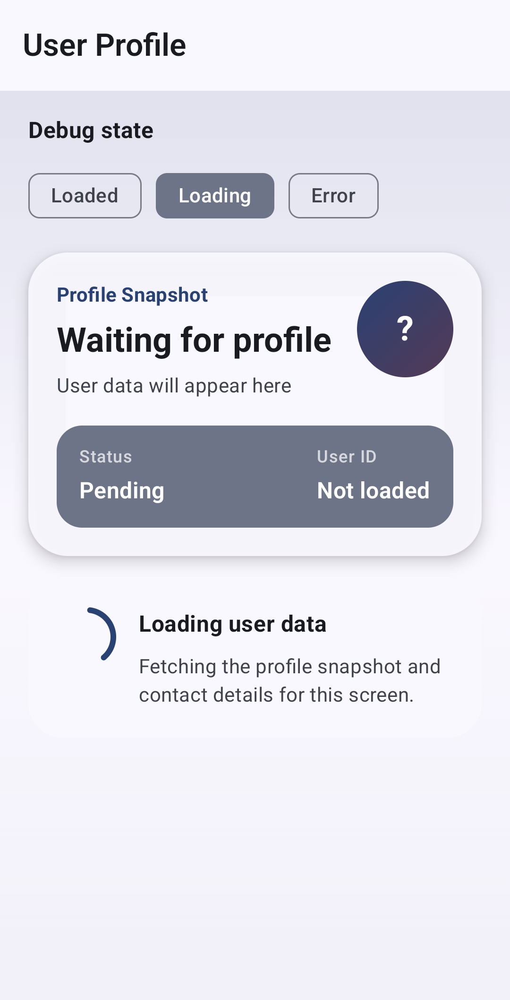
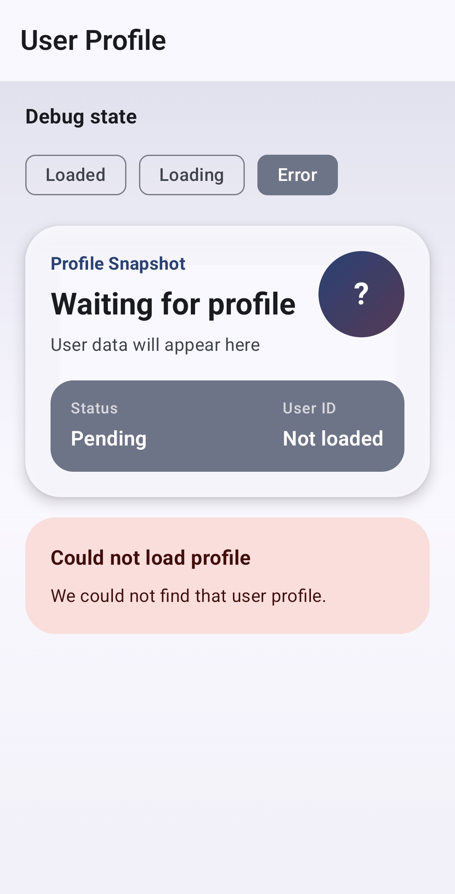
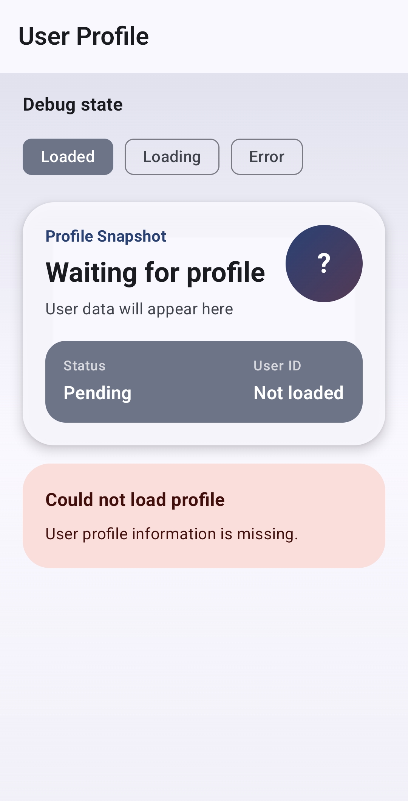

# Hilt Practice Codex

수동 의존성 주입으로 만든 Android Compose 예제를 Hilt 기반 구조로 전환하며 학습한 내용을 정리한 프로젝트입니다.

이 프로젝트의 핵심은 단순히 `@Inject`를 붙이는 것이 아니라, `Activity -> ViewModel -> UseCase -> Repository -> DataSource`로 이어지는 객체 생성 흐름을 Hilt가 관리하도록 바꾸고, 그 과정에서 MVVM과 Clean Architecture의 경계를 함께 정리하는 것입니다.

## README 목차

1. 프로젝트 목적
2. 앱 실행 화면과 사용자 동작
3. 모바일 기기 검증 스크린샷
4. Hilt 적용 전후 비교
5. 주요 전환 단계
6. 아키텍처 구조
7. Hilt 의존성 흐름
8. 주요 파일
9. 실행 및 검증 방법
10. 테스트
11. 학습 포인트
12. 남은 과제

## 프로젝트 목적

이 앱은 Hilt를 학습하기 위한 User Profile 샘플입니다.

프로젝트를 만든 이유는 다음과 같습니다.

- 수동 DI와 Hilt DI의 차이를 실제 코드 변경으로 비교하기 위해
- ViewModel, Repository, DataSource 생성 책임을 직접 연결하던 구조에서 Hilt graph 기반 구조로 전환하기 위해
- 학습용 예제를 현업 코드에 가까운 계층 구조로 개선하기 위해
- Hilt 적용 과정에서 테스트, release 설정, UI 상태 관리까지 함께 점검하기 위해

## 앱 실행 화면과 사용자 동작

앱을 실행하면 `User Profile` 화면이 표시됩니다.

화면은 프로필 스냅샷 카드와 현재 상태 메시지를 보여줍니다.

- Loaded: 사용자 프로필 데이터가 정상적으로 로드된 상태
- Loading: 사용자 프로필을 불러오는 중인 상태
- Error: 사용자를 찾지 못했거나 user id가 전달되지 않은 상태

debug 빌드에서는 화면 상단에 `Debug state` 영역이 표시됩니다. 사용자는 `Loaded`, `Loading`, `Error` 버튼을 눌러 각 UI 상태를 직접 확인할 수 있습니다. 이 기능은 학습과 UI 검증을 위한 debug 전용 동작이며, release 빌드에서는 표시되지 않습니다.

`MainActivity`는 Intent extra로 user id를 받습니다.

```kotlin
const val EXTRA_USER_ID = "com.cret.hilt_practice.extra.USER_ID"
```

앱이 user id 없이 실행되면 실제 데이터 로딩을 시도하지 않고 `User profile information is missing.` 오류 화면을 보여줍니다. 이 케이스는 navigation argument나 외부 진입점에서 필수 인자가 빠졌을 때의 방어 흐름을 확인하기 위해 남겨둔 상태입니다.

## 모바일 기기 검증 스크린샷

아래 화면은 실제 모바일 기기에서 debug 빌드로 실행해 검증한 결과입니다.

<p>
  
  
  
</p>

- Loading: `Loading` 버튼으로 로딩 상태 UI 확인
- Error: `Error` 버튼으로 사용자 조회 실패 UI 확인
- Missing user id: Intent extra 없이 실행했을 때 필수 user id 누락 UI 확인

## Hilt 적용 전후 비교

| 구분 | Hilt 적용 전 | Hilt 적용 후 |
| --- | --- | --- |
| 객체 생성 | `AppContainer`, Factory, Activity에서 직접 연결 | Hilt graph가 생성과 주입 담당 |
| Application | 수동 DI 컨테이너 보관 | `@HiltAndroidApp` 진입점 |
| Activity | ViewModel Factory를 직접 구성 | `@AndroidEntryPoint`로 Hilt graph 연결 |
| ViewModel | Factory를 통해 Repository 주입 | `@HiltViewModel`과 constructor injection 사용 |
| 비즈니스 흐름 | ViewModel이 Repository를 직접 바라봄 | ViewModel이 `GetUserProfileUseCase`에 의존 |
| Repository | 학습용 fake 구현 중심 | interface와 implementation 분리 |
| UI 모델 | data model이 UI까지 노출될 수 있음 | `UserProfileUiModel`, `UserUiState`로 presentation 경계 분리 |
| 에러 처리 | raw message 또는 광범위한 예외 처리 위험 | 예상 가능한 domain error와 string resource id로 매핑 |
| 테스트 | ViewModel 동작 위주 | ViewModel 상태와 Hilt graph 주입 검증 포함 |

## 주요 전환 단계

1. 수동 DI 구조 확인
   - `Application`, `Activity`, `ViewModelFactory`, `Repository`가 어떻게 연결되는지 먼저 파악했습니다.

2. Application 이름 정리
   - 학습 흐름에 맞춰 `ManualDiApplication`에서 Hilt 적용 이후의 의미가 드러나는 이름으로 정리했습니다.

3. Hilt 의존성 추가
   - Hilt Gradle plugin, KSP, AndroidX Hilt Compose 의존성을 추가했습니다.

4. Hilt 진입점 적용
   - `@HiltAndroidApp`, `@AndroidEntryPoint`, `@HiltViewModel`을 적용했습니다.

5. 수동 DI 제거
   - `AppContainer`, `UserViewModelFactory` 중심의 직접 연결을 제거하고 constructor injection으로 전환했습니다.

6. domain/usecase 계층 추가
   - `GetUserProfileUseCase`, `UserRepository`, `UserProfile`을 추가해 ViewModel이 data 계층을 직접 알지 않도록 정리했습니다.

7. UI 상태와 UI 모델 분리
   - 화면은 `UserUiState`와 `UserProfileUiModel`만 사용하도록 정리했습니다.

8. debug 상태 검증 UI 복구
   - debug 빌드에서 `Loaded`, `Loading`, `Error` 상태를 버튼으로 확인할 수 있게 했습니다.

9. 테스트와 release 설정 보강
   - ViewModel unit test, Hilt graph test, release minify/shrink 설정을 추가했습니다.

## 아키텍처 구조

현재 구조는 MVVM을 기반으로 하고, domain/usecase 계층을 둔 Clean Architecture 형태로 정리되어 있습니다.

```text
app/src/main/java/com/cret/hilt_practice
├── HiltPracticeApplication.kt
├── MainActivity.kt
├── data
│   ├── model
│   │   └── User.kt
│   ├── repository
│   │   └── UserRepositoryImpl.kt
│   └── source
│       ├── LocalUserDataSource.kt
│       └── UserDataSource.kt
├── di
│   └── RepositoryModule.kt
├── domain
│   ├── error
│   │   └── UserNotFoundException.kt
│   ├── model
│   │   └── UserProfile.kt
│   ├── repository
│   │   └── UserRepository.kt
│   └── usecase
│       └── GetUserProfileUseCase.kt
└── presentation
    ├── ui
    │   ├── screen
    │   │   ├── UserProfileUiModel.kt
    │   │   ├── UserScreen.kt
    │   │   ├── UserScreenDebugState.kt
    │   │   ├── UserScreenRoute.kt
    │   │   ├── UserScreenSections.kt
    │   │   └── UserUiState.kt
    │   └── theme
    └── viewmodel
        └── UserViewModel.kt
```

테스트 구조는 다음과 같습니다.

```text
app/src/test/java/com/cret/hilt_practice
└── ExampleUnitTest.kt

app/src/androidTest/java/com/cret/hilt_practice
├── ExampleInstrumentedTest.kt
├── HiltGraphTest.kt
└── HiltTestRunner.kt
```

## Hilt 의존성 흐름

현재 앱의 주요 의존성 흐름은 다음과 같습니다.

```text
UserScreenRoute
    -> UserViewModel
        -> GetUserProfileUseCase
            -> UserRepository
                -> UserRepositoryImpl
                    -> UserDataSource
                        -> LocalUserDataSource
```

Hilt graph에서는 `RepositoryModule`이 다음 interface와 implementation 관계를 연결합니다.

```kotlin
UserRepository -> UserRepositoryImpl
UserDataSource -> LocalUserDataSource
```

## 주요 파일

- `HiltPracticeApplication.kt`
  - `@HiltAndroidApp`이 적용된 Hilt graph 시작 지점입니다.
- `MainActivity.kt`
  - `@AndroidEntryPoint`가 적용된 Activity입니다.
  - Intent extra에서 user id를 읽어 `UserScreenRoute`로 전달합니다.
- `RepositoryModule.kt`
  - domain repository와 data source interface를 Hilt graph에 바인딩합니다.
- `GetUserProfileUseCase.kt`
  - ViewModel과 Repository 사이의 application business rule 역할을 합니다.
- `UserViewModel.kt`
  - `@HiltViewModel` 기반 ViewModel입니다.
  - UI 상태를 만들고, domain error를 사용자에게 안전한 string resource id로 매핑합니다.
- `UserScreenRoute.kt`
  - route-level Composable입니다.
  - `hiltViewModel()`로 ViewModel을 획득하고 화면에 상태를 전달합니다.
- `UserScreen.kt`
  - ViewModel을 모르는 순수 UI Composable입니다.
- `UserScreenDebugState.kt`
  - debug 상태 선택을 위한 presentation 전용 모델입니다.

## 실행 및 검증 방법

프로젝트 루트에서 다음 명령을 사용할 수 있습니다.

```bash
./gradlew :app:testDebugUnitTest
./gradlew :app:compileDebugAndroidTestKotlin
./gradlew :app:assembleDebug
./gradlew :app:assembleRelease
```

debug 빌드를 실기기에 설치하려면 다음 명령을 사용할 수 있습니다.

```bash
./gradlew :app:installDebug
```

Intent extra로 user id를 전달해 실행하려면 다음처럼 실행합니다.

```bash
adb shell am start \
  -n com.cret.codex_hilt_practice/com.cret.hilt_practice.MainActivity \
  --es com.cret.hilt_practice.extra.USER_ID codex-student
```

Intent extra 없이 실행하면 missing user id 상태가 표시됩니다.

```bash
adb shell am start \
  -n com.cret.codex_hilt_practice/com.cret.hilt_practice.MainActivity
```

release 빌드는 다음 명령으로 생성할 수 있습니다.

```bash
./gradlew :app:assembleRelease
```

release APK를 실제 휴대폰에 설치하려면 signing 설정이 필요합니다. 현재 프로젝트는 학습용 샘플이므로 Android Studio의 `Generate Signed Bundle / APK` 흐름을 사용하거나, 로컬 signing config를 별도로 구성한 뒤 release artifact를 설치하는 방식이 적절합니다.

최근 검증된 내용은 다음과 같습니다.

- `./gradlew :app:testDebugUnitTest :app:compileDebugAndroidTestKotlin :app:assembleRelease` 성공
- `./gradlew :app:testDebugUnitTest :app:assembleDebug` 성공
- 실제 모바일 기기에서 debug 빌드 화면 확인 완료
- debug 상태 선택 UI로 Loading, Error, Missing user id 화면 확인 완료

## 테스트

현재 포함된 테스트는 다음과 같습니다.

- `ExampleUnitTest`
  - ViewModel success state 검증
  - user not found error state 검증
  - missing user id state 검증
- `HiltGraphTest`
  - Hilt graph가 `UserRepository`를 주입할 수 있는지 검증
- `ExampleInstrumentedTest`
  - 기본 app context 검증

아직 보강하면 좋은 테스트는 다음과 같습니다.

- Compose UI 테스트
- 실제 connected Android test 실행 결과 기록
- 접근성 semantics 검증
- debug/release variant별 UI 노출 여부 테스트

## 기술 스택

- Kotlin `2.0.21`
- Android Gradle Plugin `8.9.2`
- Jetpack Compose BOM `2026.04.01`
- Hilt `2.57.1`
- AndroidX Hilt `1.3.0`
- KSP `2.0.21-1.0.27`
- Material 3
- Kotlin Coroutines Test
- JUnit4

## 학습 포인트

- Hilt는 객체 생성과 주입을 자동화하지만, 아키텍처 품질을 자동으로 보장하지는 않습니다.
- `compileDebugKotlin`만으로는 테스트 코드 오류를 잡을 수 없습니다.
- ViewModel이 Repository보다 UseCase에 의존하면 화면 요구사항과 business flow가 더 명확해집니다.
- UI는 data model이 아니라 UI model을 사용하는 편이 계층 경계에 좋습니다.
- route-level Composable의 `hiltViewModel()`은 실무에서 흔히 쓰이지만, 순수 UI Composable에는 ViewModel을 직접 넘기지 않는 편이 테스트와 preview에 유리합니다.
- 빌드 성공, APK 생성, 실제 디바이스 실행은 서로 다른 검증 단계입니다.

## 남은 과제

- debug 관련 코드를 `src/debug` source set으로 분리해 release artifact에서 더 엄격하게 제외하기
- Compose UI 테스트 추가
- 실제 API 또는 DB 기반 data source 도입
- Navigation argument 기반 user id 전달 구조 확장
- CI에서 unit test, androidTest compile, assemble task 자동화
- release signing, versioning, 배포 체크리스트 정리

## 회고 문서

작업 과정은 `docs/retrospectives`에 회고 문서로 정리되어 있습니다.

- `Hilt_2026_001`: Manual DI와 초기 화면 구조 정리
- `Hilt_2026_002`: 회고 작성 방식과 이전 작업 대비 점검
- `Hilt_2026_003`: Hilt 적용, 현업 기준 구조 개선, 테스트/검증, 커밋/푸시 과정 정리

주요 문서:

- `docs/retrospectives/Hilt_2026_003_full.md`
- `docs/retrospectives/Hilt_2026_003_summary.md`
- `docs/retrospectives/Hilt_2026_003_learning.md`
- `docs/retrospectives/Hilt_2026_003_risks.md`
